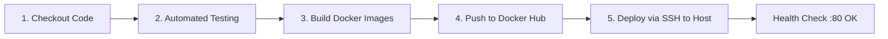

# Confession Wall (Bức Tường Thú Tội) — Fullstack Application

[](https://spring.io/projects/spring-boot)
[](https://adoptium.net/)
[](https://www.postgresql.org/)
[](https://react.dev/)
[](https://vitejs.dev/)
[](https://tailwindcss.com/)
[](https://threejs.org/)
[](https://www.docker.com/)
[](https://www.jenkins.io/)

Ứng dụng fullstack **"Bức Tường Thú Tội" (Confession Wall)** hiện đại, cho phép người dùng chia sẻ tâm sự ẩn danh, duyệt bài viết theo thời gian thực và tương tác thả tim. Giao diện được tích hợp đồ họa 3D tương tác (Three.js / React Three Fiber) sống động và mượt mà. Dự án được đóng gói container hóa hoàn chỉnh với Docker & Docker Compose, tích hợp pipeline CI/CD tự động qua Jenkins, sẵn sàng triển khai thực tế an toàn trên mọi máy chủ Linux / Cloud.

A modern fullstack **"Confession Wall"** application allowing anonymous confessions, real-time feed browsing, interactive heart reactions, and 3D WebGL ambient graphics. The application is fully containerized with Docker & Docker Compose and backed by an automated Jenkins CI/CD pipeline ready for production deployment.

---

## Mục Lục / Table of Contents

1. [Kiến Trúc & Ngăn Xếp Công Nghệ (Architecture & Tech Stack)](#1-kiến-trúc--ngăn-xếp-công-nghệ-architecture--tech-stack)
2. [Cấu Hình Biến Môi Trường (Environment Variables)](#2-cấu-hình-biến-môi-trường-environment-variables)
3. [Khởi Chạy Nhanh Với Docker Compose (Docker Quickstart)](#3-khởi-chạy-nhanh-với-docker-compose-docker-quickstart)
4. [Hướng Dẫn Phát Triển Cục Bộ (Manual Local Development)](#4-hướng-dẫn-phát-triển-cục-bộ-manual-local-development)
5. [Tài Liệu REST API & Ví Dụ cURL (REST API Documentation)](#5-tài-liệu-rest-api--ví-dụ-curl-rest-api-documentation)
6. [Kiểm Thử Tự Động (Automated Testing)](#6-kiểm-thử-tự-động-automated-testing)
7. [Quy Trình Tự Động Hóa CI/CD Jenkins (CI/CD Pipeline)](#7-quy-trình-tự-động-hóa-cicd-jenkins-cicd-pipeline)
8. [Cấu Trúc Thư Mục Dự Án (Project Structure)](#8-cấu-trúc-thư-mục-dự-án-project-structure)
9. [English Documentation (Comprehensive Guide)](#9-english-documentation)

---

## 1. Kiến Trúc & Ngăn Xếp Công Nghệ (Architecture & Tech Stack)

### Sơ Đồ Kiến Trúc Mạng & Dịch Vụ (System Architecture)

```
                            +------------------------------------+
                            |          Trình Duyệt (Browser)     |
                            +-----------------+------------------+
                                              |
                                              | HTTP Port 80 (hoặc FRONTEND_PORT)
                                              v
                            +-----------------+------------------+
                            |     Frontend Container (Nginx)     |
                            |   Port host 80 -> Container :8080  |
                            |   (Phục vụ React SPA & Nginx Proxy)|
                            +-----------------+------------------+
                                              |
                        [Mạng nội bộ riêng confession-network]
                                              |
                                              | proxy_pass http://backend:8080/api/
                                              v
                            +-----------------+------------------+
                            |   Backend Container (Spring Boot)  |
                            |       Internal Port: 8080          |
                            |     (Không mở cổng ra ngoài host)  |
                            +-----------------+------------------+
                                              |
                                              | JDBC Connection :5432
                                              | (Health check: pg_isready)
                                              v
                            +-----------------+------------------+
                            |   Postgres Container (PostgreSQL)  |
                            |       Internal Port: 5432          |
                            |     (Không mở cổng ra ngoài host)  |
                            |     Named volume: postgres_data    |
                            +------------------------------------+
```

> **Tiêu chuẩn an toàn mạng (Production Security):**
> Trong môi trường triển khai Docker Compose, các cổng của CSDL PostgreSQL (`5432`) và Spring Boot API (`8080`) được **cô lập hoàn toàn bên trong mạng nội bộ `confession-network`** và không mở trực tiếp ra máy chủ ngoài (host). Toàn bộ lưu lượng truy cập của người dùng và gọi API đều đi qua Nginx Reverse Proxy tại cổng `FRONTEND_PORT` (mặc định: `80`).

### Ngăn Xếp Công Nghệ (Tech Stack)

| Thành phần | Công nghệ | Chi tiết |
| :--- | :--- | :--- |
| **Backend** | Java 17, Spring Boot 3.2.4 | Spring Data JPA, Hibernate, Jakarta Bean Validation, H2 (In-memory Test), PostgreSQL JDBC Driver |
| **Frontend** | React 18, Vite 5, Tailwind CSS 3.4 | Axios (`api.js`), Lucide React icons, Single Page Application |
| **Đồ họa 3D** | Three.js, React Three Fiber (`@react-three/fiber`, `@react-three/drei`) | Trái tim 3D tương tác tại tiêu đề, hạt tâm tư 3D lơ lửng, WebGL fallback an toàn |
| **Cơ sở dữ liệu** | PostgreSQL 15 (Alpine) | Lưu trữ bền bỉ với Docker Named Volume `postgres_data`, tự động tạo/cập nhật bảng qua Hibernate |
| **Web Server / Proxy** | Nginx Unprivileged Alpine | Máy chủ Nginx không cần quyền root (Non-root user `nginx`, port `8080` nội bộ), cấu hình Header bảo mật & Reverse Proxy `/api/` |
| **Containerization** | Docker Multi-stage Builds | Ảnh chạy nhỏ gọn (`eclipse-temurin:17-jre-alpine` & `nginxinc/nginx-unprivileged:alpine`), Non-root user |
| **CI/CD** | Jenkins Pipeline (`Jenkinsfile`), Docker Hub | Kịch bản 5 giai đoạn: Test tự động, Build image, Push Docker Hub, Deploy SSH với Health Check tự động |

---

## 2. Cấu Hình Biến Môi Trường (Environment Variables)

Dự án cung cấp tệp tin mẫu `.env.example`. Trước khi chạy ứng dụng hoặc pipeline, hãy tạo tệp `.env` từ bản mẫu:

```bash
cp .env.example .env
```

### Bảng Giải Thích Biến Môi Trường

| Tên biến | Giá trị mặc định | Giải thích |
| :--- | :--- | :--- |
| `POSTGRES_DB` | `confession_db` | Tên cơ sở dữ liệu PostgreSQL cho ứng dụng |
| `POSTGRES_USER` | `postgres` | Tài khoản quản trị cơ sở dữ liệu PostgreSQL |
| `POSTGRES_PASSWORD` | `postgres` | Mật khẩu tài khoản PostgreSQL (Nên đổi trong môi trường production) |
| `FRONTEND_PORT` | `80` | Cổng công khai trên máy chủ host để truy cập giao diện web & API |
| `DOCKER_USERNAME` | `phwkha` | Tên người dùng Docker Hub phục vụ đóng gói và kéo image |
| `IMAGE_TAG` | `latest` | Thẻ phiên bản image (Pipeline Jenkins sẽ tự động gán build number) |

---

## 3. Khởi Chạy Nhanh Với Docker Compose (Docker Quickstart)

### Yêu Cầu Tiên Quyết (Prerequisites)
- Đã cài đặt [Docker Engine](https://docs.docker.com/engine/install/) (phiên bản 20.10 trở lên).
- Đã cài đặt [Docker Compose](https://docs.docker.com/compose/install/) (phiên bản v2 trở lên).

### Bước 1: Chuẩn bị tệp môi trường
```bash
# Tạo file .env từ file mẫu nếu chưa có
cp .env.example .env
```

### Bước 2: Khởi động toàn bộ cụm dịch vụ
Chạy lệnh sau tại thư mục gốc của dự án:
```bash
docker compose up -d --build
```

Hệ thống sẽ thực hiện theo thứ tự:
1. Tải image `postgres:15-alpine`, khởi tạo dữ liệu `confession_db` và chạy healthcheck định kỳ (`pg_isready`).
2. Biên dịch mã nguồn Backend bằng Maven (`maven:3.9.6-eclipse-temurin-17-alpine`) đa tầng, tạo JAR chạy trên ảnh nhẹ `eclipse-temurin:17-jre-alpine` (user non-root).
3. Đợi container PostgreSQL chuyển sang trạng thái `healthy` trước khi khởi động ứng dụng Spring Boot.
4. Biên dịch Frontend React + Vite với Node.js 20 và đóng gói vào Nginx unprivileged.
5. Kết nối toàn bộ dịch vụ trong mạng an toàn `confession-network`.

### Bước 3: Kiểm tra trạng thái hoạt động
```bash
docker compose ps
```

**Kết quả mong đợi**:
```
NAME                  IMAGE                              COMMAND                  SERVICE      STATUS              PORTS
confession_backend    phwkha/confession-backend:latest    "java -jar app.jar"      backend      running             8080/tcp
confession_frontend   phwkha/confession-frontend:latest   "nginx -g 'daemon of…"   frontend     running             0.0.0.0:80->8080/tcp
confession_postgres   postgres:15-alpine                 "docker-entrypoint.s…"   postgres     running (healthy)   5432/tcp
```
*(Cổng 8080 của Backend và 5432 của PostgreSQL chỉ hoạt động trong mạng nội bộ, chỉ cổng 80 của Nginx được mở ra host)*

### Bước 4: Truy cập ứng dụng
- **Giao diện người dùng (Frontend SPA)**: [http://localhost](http://localhost) (hoặc cổng cấu hình trong `FRONTEND_PORT`).
- **REST API Endpoint (qua Nginx Proxy)**: [http://localhost/api/confessions](http://localhost/api/confessions).

### Bước 5: Xem nhật ký hoạt động (Container Logs)
```bash
# Xem log toàn bộ hệ thống
docker compose logs -f

# Xem log riêng Backend
docker compose logs -f backend

# Xem log riêng Frontend Nginx
docker compose logs -f frontend

# Xem log CSDL PostgreSQL
docker compose logs -f postgres
```

### Bước 6: Dừng và dọn dẹp hệ thống
```bash
# Dừng và gỡ bỏ containers, mạng nội bộ (Dữ liệu database được giữ lại trong volume)
docker compose down

# Dừng và xóa toàn bộ dữ liệu CSDL (Reset database hoàn toàn)
docker compose down -v
```

---

## 4. Hướng Dẫn Phát Triển Cục Bộ (Manual Local Development)

Dành cho nhà phát triển muốn chạy độc lập Backend và Frontend trực tiếp trên máy chủ cá nhân để debug và viết mã.

### Yêu Cầu Môi Trường
- **Java**: OpenJDK / Temurin JDK 17 trở lên
- **Node.js**: Phiên bản 18+ và npm 9+
- **PostgreSQL**: PostgreSQL 15+ đang chạy cục bộ tại cổng `5432`

---

### Bước 1: Chuẩn bị cơ sở dữ liệu PostgreSQL cục bộ
Đăng nhập PostgreSQL cục bộ qua `psql` và thiết lập database:
```sql
CREATE DATABASE confession_db;
CREATE USER postgres WITH ENCRYPTED PASSWORD 'postgres';
GRANT ALL PRIVILEGES ON DATABASE confession_db TO postgres;
```

---

### Bước 2: Chạy Backend (Spring Boot 3)
```bash
cd backend

# Kiểm tra và chạy bộ unit test tự động (sử dụng in-memory H2 DB độc lập)
./mvnw clean test

# Khởi chạy ứng dụng backend kết nối với PostgreSQL cục bộ
./mvnw spring-boot:run
```
Backend sẽ khởi động tại địa chỉ: `http://localhost:8080`.

---

### Bước 3: Chạy Frontend (React 18 + Vite + Three.js)
Mở một cửa sổ Terminal mới:
```bash
cd frontend

# Cài đặt toàn bộ dependencies (React, Three.js, R3F, Tailwind CSS, Axios)
npm install

# Khởi chạy máy chủ phát triển Vite với Hot Module Replacement (HMR)
npm run dev
```

Mở trình duyệt tại [http://localhost:3000](http://localhost:3000). Máy chủ phát triển Vite đã được cấu hình sẵn tính năng proxy để tự động chuyển tiếp các yêu cầu `/api/*` tới `http://localhost:8080`.

---

## 5. Tài Liệu REST API & Ví Dụ cURL (REST API Documentation)

Toàn bộ các endpoints API đều hỗ trợ CORS (`@CrossOrigin(origins = "*")`) và trả về dữ liệu định dạng JSON UTF-8 chuẩn.

> **Lưu ý về URL gọi API:**
> - Khi chạy bằng **Docker Compose**: Gọi qua Nginx reverse proxy tại `http://localhost/api/confessions` (hoặc cổng `FRONTEND_PORT`).
> - Khi chạy **phát triển cục bộ (Local Backend)**: Gọi trực tiếp tới `http://localhost:8080/api/confessions`.
> *(Các ví dụ bên dưới sử dụng cổng Nginx mặc định `http://localhost`)*

---

### 1. `GET /api/confessions`
Lấy danh sách tất cả các lời thú tội, tự động sắp xếp theo thời gian tạo mới nhất lên đầu (`createdAt` giảm dần).

- **Phương thức**: `GET`
- **Đường dẫn**: `/api/confessions`
- **Mã phản hồi**: `200 OK`

**Ví dụ lệnh cURL**:
```bash
curl -X GET "http://localhost/api/confessions" -H "Accept: application/json"
```

**Mẫu kết quả JSON (200 OK)**:
```json
[
  {
    "id": 1,
    "content": "Thích thầm bạn cùng bàn từ năm nhất mà không dám nói...",
    "author": "Ẩn danh",
    "likes": 5,
    "createdAt": "2026-09-14T10:15:30"
  }
]
```

---

### 2. `POST /api/confessions`
Đăng một lời thú tội mới lên hệ thống.
- Nếu trường `author` bị bỏ trống, chỉ chứa khoảng trắng hoặc không truyền, hệ thống sẽ tự động gán giá trị mặc định là `"Ẩn danh"`.
- Trường `content` bắt buộc phải có, không được để trống và không được vượt quá độ dài giới hạn.

- **Phương thức**: `POST`
- **Đường dẫn**: `/api/confessions`
- **Headers**: `Content-Type: application/json`
- **Mã phản hồi**: `201 Created` (thành công) hoặc `400 Bad Request` (dữ liệu không hợp lệ)

**Ví dụ 1: Gửi thành công với tên tác giả cụ thể**:
```bash
curl -X POST "http://localhost/api/confessions" \
  -H "Content-Type: application/json" \
  -d '{
    "content": "Cảm ơn em vì đã xuất hiện trong thanh xuân của anh!",
    "author": "Minh Khang"
  }'
```
*Phản hồi (201 Created)*:
```json
{
  "id": 2,
  "content": "Cảm ơn em vì đã xuất hiện trong thanh xuân của anh!",
  "author": "Minh Khang",
  "likes": 0,
  "createdAt": "2026-09-14T10:20:00"
}
```

**Ví dụ 2: Gửi ẩn danh (không truyền tác giả)**:
```bash
curl -X POST "http://localhost/api/confessions" \
  -H "Content-Type: application/json" \
  -d '{
    "content": "Hôm nay trời đẹp quá, mong người tôi thương luôn bình an."
  }'
```
*Phản hồi (201 Created)*:
```json
{
  "id": 3,
  "content": "Hôm nay trời đẹp quá, mong người tôi thương luôn bình an.",
  "author": "Ẩn danh",
  "likes": 0,
  "createdAt": "2026-09-14T10:22:15"
}
```

**Ví dụ 3: Gửi thất bại do nội dung rỗng (Validation Error)**:
```bash
curl -X POST "http://localhost/api/confessions" \
  -H "Content-Type: application/json" \
  -d '{
    "content": "   ",
    "author": "Tester"
  }'
```
*Phản hồi lỗi (400 Bad Request)*:
```json
{
  "timestamp": "2026-09-14T10:25:00",
  "status": 400,
  "error": "Bad Request",
  "message": "Nội dung lời thú tội không được để trống",
  "path": "/api/confessions"
}
```

---

### 3. `PUT /api/confessions/{id}/like`
Tăng số lượt thả tim của lời thú tội có ID tương ứng lên 1 đơn vị.

- **Phương thức**: `PUT`
- **Đường dẫn**: `/api/confessions/{id}/like`
- **Mã phản hồi**: `200 OK` (thành công) hoặc `404 Not Found` (không tìm thấy ID)

**Ví dụ 1: Thả tim thành công**:
```bash
curl -X PUT "http://localhost/api/confessions/2/like"
```
*Phản hồi (200 OK)*:
```json
{
  "id": 2,
  "content": "Cảm ơn em vì đã xuất hiện trong thanh xuân của anh!",
  "author": "Minh Khang",
  "likes": 1,
  "createdAt": "2026-09-14T10:20:00"
}
```

**Ví dụ 2: Thả tim bài viết không tồn tại**:
```bash
curl -X PUT "http://localhost/api/confessions/999999/like"
```
*Phản hồi lỗi (404 Not Found)*:
```json
{
  "timestamp": "2026-09-14T10:30:00",
  "status": 404,
  "error": "Not Found",
  "message": "Lời thú tội không tồn tại với ID: 999999",
  "path": "/api/confessions/999999/like"
}
```

---

## 6. Kiểm Thử Tự Động (Automated Testing)

Dự án chú trọng tính toàn vẹn và độ tin cậy với hệ thống kiểm thử tự động đa tầng:

### Kiểm thử Backend (Spring Boot Unit & Integration Tests)
Backend bao gồm 16 kịch bản kiểm thử toàn diện được viết bằng **JUnit 5**, **Mockito**, và **MockMvc**:
- `ConfessionServiceTest`: Kiểm thử nghiệp vụ Service, tạo bài viết mặc định ẩn danh, kiểm tra tăng like, xử lý ngoại lệ `ResourceNotFoundException`.
- `ConfessionControllerTest`: Kiểm thử tầng Controller REST endpoints, xác thực mã phản hồi HTTP (200, 201, 400, 404) và kiểm định Bean Validation `@Valid`.
- `ConfessionWallApplicationTests`: Kiểm thử tích hợp khởi động Spring Context hoàn chỉnh trên cơ sở dữ liệu in-memory H2 độc lập (`application-test.yml`), đảm bảo quá trình test không phụ thuộc và không làm sai lệch dữ liệu PostgreSQL.

Chạy toàn bộ kiểm thử backend:
```bash
cd backend
./mvnw clean test
```

### Kiểm thử Frontend Service
Frontend cung cấp bộ kiểm thử cho tầng API client (`frontend/src/services/__tests__/api.test.js`) mô phỏng các hợp đồng dữ liệu Axios, xác thực hành vi gửi payload và gán author mặc định.

---

## 7. Quy Trình Tự Động Hóa CI/CD Jenkins (CI/CD Pipeline)

Dự án được tích hợp kịch bản CI/CD chuẩn công nghiệp thông qua `Jenkinsfile`, tự động kích hoạt khi có sự kiện đẩy mã nguồn lên nhánh chính (`GitHub Push Trigger`).

### Các Giai Đoạn Trong Pipeline (Pipeline Stages)



1. **Stage 1: Checkout Code**: Tải mã nguồn mới nhất từ kho lưu trữ GitHub.
2. **Stage 2: Automated Testing**:
   - Tự động chuẩn bị `maven-wrapper.jar` nếu thiếu.
   - Thực thi lệnh `./mvnw clean test` để chạy toàn bộ 16 bài kiểm thử đơn vị & tích hợp. Nếu bất kỳ bài test nào thất bại, pipeline sẽ dừng ngay lập tức để bảo vệ hệ thống.
3. **Stage 3: Build Docker Images**:
   - Đóng gói container đa tầng cho Backend (Spring Boot 3 JAR) và Frontend (Vite build + Nginx).
   - Đặt nhãn theo số hiệu bản build (`${BUILD_NUMBER}`) và đồng thời gắn thẻ `latest`.
4. **Stage 4: Push to Docker Hub**:
   - Sử dụng thông tin bảo mật an toàn (`docker-hub-credentials`) để đăng nhập và đẩy ảnh container lên Docker Hub (`phwkha/confession-backend` và `phwkha/confession-frontend`).
5. **Stage 5: Deploy via SSH to Host**:
   - Kết nối SSH an toàn tới máy chủ triển khai thông qua thông tin xác thực `deploy-server-ssh`.
   - Đồng bộ hóa tệp `docker-compose.yml` lên máy chủ.
   - Kéo các Docker images phiên bản mới nhất từ Docker Hub.
   - Khởi động lại các container mà không làm gián đoạn CSDL PostgreSQL (`docker compose up -d --no-deps backend frontend`).
   - **Vòng lặp kiểm tra sức khỏe tự động (Post-deploy Health Check)**: Gửi request `curl` kiểm tra phản hồi `200 OK` từ endpoint `http://127.0.0.1:80/api/confessions`. Nếu sau 10 lần thử (30 giây) hệ thống chưa sẵn sàng, pipeline sẽ tự động in log lỗi và báo thất bại.

---

## 8. Cấu Trúc Thư Mục Dự Án (Project Structure)

```text
test-deploy/
├── .env.example                         # Tệp tin mẫu cấu hình biến môi trường
├── .gitignore                           # Danh sách loại trừ tệp tin phiên bản
├── AGENTS.md                            # Quy định phát triển và hướng dẫn cho AI Agents
├── Jenkinsfile                          # Pipeline định nghĩa tự động hóa CI/CD Jenkins
├── README.md                            # Tài liệu hướng dẫn sử dụng và triển khai dự án
├── docker-compose.yml                   # Cấu hình điều phối các container (Postgres, Backend, Frontend)
├── backend/                             # Dịch vụ Backend (Spring Boot 3 REST API)
│   ├── Dockerfile                       # Multi-stage Dockerfile cho Backend (Temurin JRE Alpine)
│   ├── mvnw / mvnw.cmd                  # Maven Wrapper script
│   ├── pom.xml                          # Quản lý thư viện phụ thuộc và cấu hình bản build Maven
│   └── src/
│       ├── main/
│       │   ├── java/com/example/confessionwall/
│       │   │   ├── ConfessionWallApplication.java    # Điểm khởi chạy Spring Boot
│       │   │   ├── controller/
│       │   │   │   └── ConfessionController.java     # REST API Controller (@RequestMapping /api/confessions)
│       │   │   ├── dto/
│       │   │   │   ├── ConfessionRequest.java        # DTO nhận dữ liệu gửi lên & Validation
│       │   │   │   └── ErrorResponse.java            # Cấu trúc phản hồi lỗi thống nhất
│       │   │   ├── exception/
│       │   │   │   ├── GlobalExceptionHandler.java   # Bắt lỗi toàn cục với @RestControllerAdvice
│       │   │   │   └── ResourceNotFoundException.java# Ngoại lệ 404 Not Found
│       │   │   ├── model/
│       │   │   │   └── Confession.java               # JPA Entity ánh xạ bảng confessions
│       │   │   ├── repository/
│       │   │   │   └── ConfessionRepository.java     # Spring Data JPA Repository
│       │   │   └── service/
│       │   │       ├── ConfessionService.java        # Giao diện Service
│       │   │       └── impl/ConfessionServiceImpl.java # Triển khai logic nghiệp vụ
│       │   └── resources/
│       │       └── application.yml              # Cấu hình ứng dụng chạy thực tế (PostgreSQL)
│       └── test/
│           ├── java/com/example/confessionwall/ # Bộ kiểm thử đơn vị & tích hợp JUnit 5
│           └── resources/
│               └── application-test.yml         # Cấu hình kiểm thử độc lập (In-memory H2 DB)
└── frontend/                            # Giao diện người dùng (React 18 + Vite + Three.js)
    ├── Dockerfile                       # Multi-stage Dockerfile cho Frontend (Nginx unprivileged)
    ├── index.html                       # Điểm neo HTML Single Page Application
    ├── nginx.conf                       # Cấu hình máy chủ Nginx (Reverse Proxy & SPA fallback)
    ├── package.json                     # Danh sách thư viện JavaScript & kịch bản npm
    ├── postcss.config.js                # Cấu hình PostCSS
    ├── tailwind.config.js               # Thiết lập giao diện và màu sắc Tailwind CSS
    ├── vite.config.js                   # Cấu hình máy chủ phát triển Vite & API Proxy
    └── src/
        ├── App.jsx                      # Thành phần giao diện chính của ứng dụng
        ├── index.css                    # Tệp tin phong cách CSS toàn cục
        ├── main.jsx                     # Điểm neo render React DOM
        ├── components/                  # Các thành phần giao diện người dùng React
        │   ├── ConfessionCard.jsx       # Thẻ hiển thị nội dung confession & nút thả tim
        │   ├── ConfessionForm.jsx       # Biểu mẫu đăng bài viết với kiểm tra dữ liệu
        │   ├── ConfessionList.jsx       # Lưới hiển thị danh sách bài viết & skeleton loader
        │   ├── Header.jsx               # Thanh tiêu đề ứng dụng
        │   └── 3d/                      # Các thành phần đồ họa 3D tương tác
        │       ├── Ambient3DBackground.jsx # Hiệu ứng hạt trái tim 3D lơ lửng nền
        │       ├── HeaderHeart3D.jsx       # Trái tim 3D tương tác xoay tại Header
        │       ├── WebGLBoundary.jsx       # Xử lý an toàn khi trình duyệt không hỗ trợ WebGL
        │       └── heartGeometry.js        # Dựng hình học khối trái tim 3D bằng Three.js
        ├── services/
        │   ├── api.js                   # Khởi tạo Axios client & các hàm gọi API tập trung
        │   └── __tests__/
        │       └── api.test.js          # Bộ kiểm thử hợp đồng dữ liệu tầng API client
        └── utils/
            └── webgl.js                 # Tiện ích phát hiện hỗ trợ WebGL trên trình duyệt
```

---

## 9. English Documentation

### Overview
**Confession Wall** is a modern, production-grade fullstack web application that provides an anonymous space for users to share their thoughts, browse messages chronologically, and react with real-time heart likes. It features interactive 3D WebGL visuals powered by Three.js and React Three Fiber, multi-stage Docker containerization, and automated Jenkins CI/CD deployment.

### Architecture & Security Highlights
- **Reverse Proxy Architecture**: Nginx serves static React SPA assets and proxies `/api/*` requests to the internal backend container.
- **Port Isolation**: PostgreSQL (`5432`) and Spring Boot (`8080`) do not expose any ports to the host machine in production. They communicate exclusively over the private Docker bridge network (`confession-network`).
- **Single Public Port**: Only Nginx is bound to the host port specified by `${FRONTEND_PORT:-80}`.
- **Unprivileged Containers**: Both Spring Boot and Nginx run as dedicated non-root users (`appuser` and `nginx`) inside lightweight Alpine Linux images.

### Quick Start with Docker Compose
1. Configure environment variables:
   ```bash
   cp .env.example .env
   ```
2. Build and launch all services:
   ```bash
   docker compose up -d --build
   ```
3. Check container health status:
   ```bash
   docker compose ps
   ```
4. Access endpoints:
   - Web Application: [http://localhost](http://localhost) (or configured `FRONTEND_PORT`)
   - API Endpoint: [http://localhost/api/confessions](http://localhost/api/confessions)
5. View logs:
   ```bash
   docker compose logs -f
   ```
6. Stop containers:
   ```bash
   docker compose down
   # To wipe persistent PostgreSQL data:
   docker compose down -v
   ```

### Local Development Setup
1. **PostgreSQL Database**:
   Create a local database named `confession_db` with user `postgres` / password `postgres` running on port `5432`.
2. **Backend (Spring Boot 3)**:
   ```bash
   cd backend
   ./mvnw clean test          # Run automated JUnit 5 tests
   ./mvnw spring-boot:run     # Run server on http://localhost:8080
   ```
3. **Frontend (React 18 + Vite 5 + Three.js)**:
   ```bash
   cd frontend
   npm install
   npm run dev                # Starts dev server on http://localhost:3000 (proxies /api to 8080)
   ```

### REST API Specifications
- `GET /api/confessions`: Retrieve all confessions ordered newest first (200 OK).
- `POST /api/confessions`: Create a new confession.
  - Body: `{ "content": "Your confession", "author": "Optional name" }`
  - Validates `content` is not blank. If `author` is omitted or empty, defaults to `"Ẩn danh"`.
  - Returns `201 Created` or `400 Bad Request`.
- `PUT /api/confessions/{id}/like`: Increment the like count by 1 (200 OK or 404 Not Found).

### Jenkins CI/CD Pipeline
The `Jenkinsfile` orchestrates an enterprise-ready 5-stage deployment pipeline:
1. **Checkout Code**: Retrieves the repository from GitHub.
2. **Automated Testing**: Executes `./mvnw clean test` (fails build if any unit test breaks).
3. **Build Docker Images**: Builds lightweight multi-stage Docker images tagged with the build number and `latest`.
4. **Push to Docker Hub**: Pushes images to Docker Hub registry with secure credentials.
5. **Deploy via SSH**: Transfers `docker-compose.yml` to the target server, pulls updated images, gracefully restarts containers without restarting the database, and performs an automated curl health check loop against `http://127.0.0.1:80/api/confessions`.
